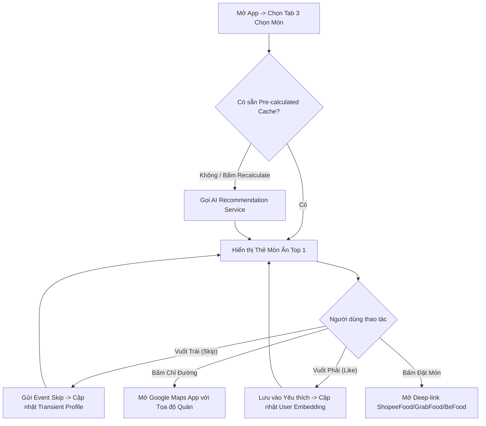
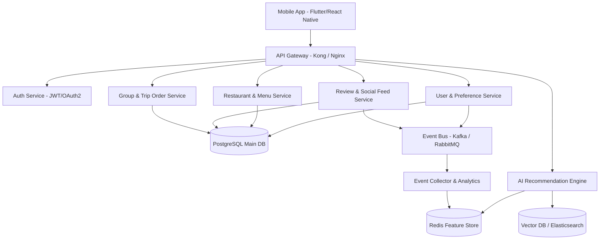
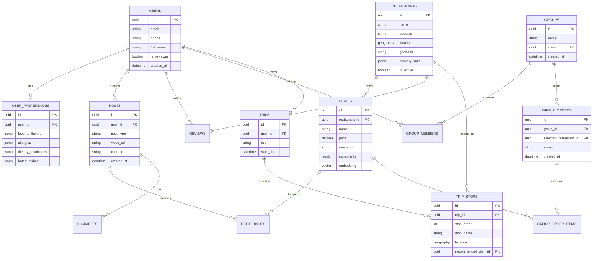
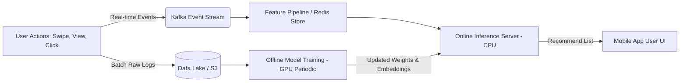
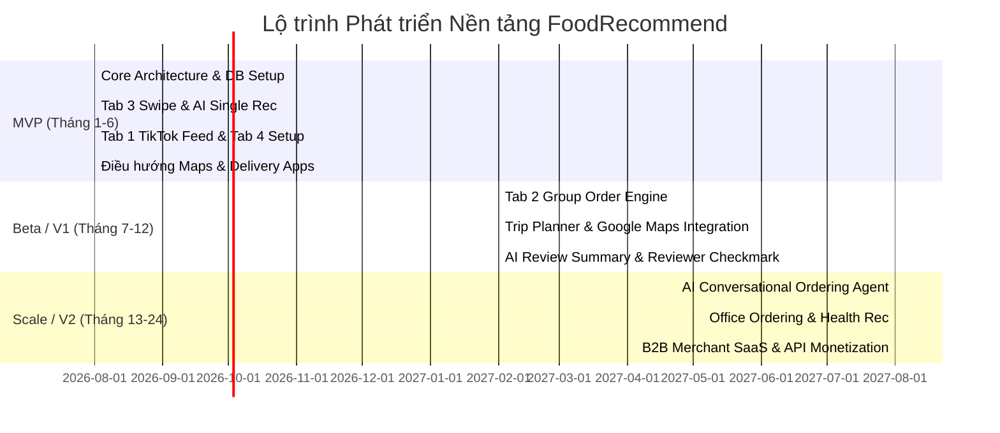

# TÀI LIỆU PHÂN TÍCH THIẾT KẾ VÀ TRIỂN KHAI SẢN PHẨM (PRODUCT DESIGN & IMPLEMENTATION DOCUMENT)
## Nền tảng AI Decision Platform – FoodRecommend

---

### MỤC LỤC
1. [Executive Summary](#1-executive-summary)
2. [Nghiên cứu thị trường (Market Research)](#2-nghiên-cứu-thị-trường-market-research)
3. [Yêu cầu hệ thống (SRS - System Requirements Specification)](#3-yêu-cầu-hệ-thống-srs---system-requirements-specification)
4. [Thiết kế UI/UX & Luồng trải nghiệm người dùng](#4-thiết-kế-uiux--luồng-trải-nghiệm-người-dùng)
5. [Kiến trúc hệ thống (System Architecture)](#5-kiến-trúc-hệ-thống-system-architecture)
6. [Kiến trúc AI & Mô hình gợi ý (AI Recommendation Architecture)](#6-kiến-trúc-ai--mô-hình-gợi-ý-ai-recommendation-architecture)
7. [Thiết kế Cơ sở dữ liệu (Database Design & ERD)](#7-thiết-kế-cơ-sở-dữ-liệu-database-design--erd)
8. [Quy trình xử lý AI (AI Pipeline & Lifecycle)](#8-quy-trình-xử-lý-ai-ai-pipeline--lifecycle)
9. [Lộ trình phát triển sản phẩm (Product Roadmap)](#9-lộ-trình-phát-triển-sản-phẩm-product-roadmap)
10. [Dự toán Chi phí & Triển khai Hạ tầng (Infrastructure & Cost Estimation)](#10-dự-toán-chi-phí--triển-khai-hạ-tầng-infrastructure--cost-estimation)

---

### 1. EXECUTIVE SUMMARY

#### 1.1 Tầm nhìn sản phẩm
**FoodRecommend** được định vị là một **AI Food Decision Platform** (Nền tảng hỗ trợ ra quyết định ẩm thực ứng dụng Trí tuệ nhân tạo). Sản phẩm hướng tới giải quyết triệt để câu hỏi hằng ngày của người tiêu dùng: *"Hôm nay ăn gì, ở đâu, đặt như thế nào?"*. Thay vì cạnh tranh trực tiếp với các ứng dụng giao đồ ăn (GrabFood, ShopeeFood, BeFood) hay nền tảng bản đồ (Google Maps), FoodRecommend đóng vai trò là "lớp bộ não trung gian" (Decision Layer), tổng hợp, phân tích, cá nhân hóa và điều hướng người dùng đến các dịch vụ đặt món / dẫn đường phù hợp nhất.

#### 1.2 Vấn đề cần giải quyết
1. **Nạn "Nghịch lý sự lựa chọn" (Paradox of Choice):** Người dùng dành trung bình 15-30 phút mỗi bữa ăn để lướt qua hàng trăm quán ăn trên Grab/ShopeeFood nhưng vẫn không chọn được món phù hợp.
2. **Quyết định nhóm phức tạp (Group Friction):** Khi ăn cùng đồng nghiệp, bạn bè hoặc người yêu, việc thống nhất một địa điểm hợp khẩu vị, ngân sách và vị trí của tất cả mọi người cực kỳ tốn thời gian.
3. **Đánh giá rác & Thiếu cá nhân hóa:** Thông tin trên mạng bị pha tạp bởi quảng cáo; hệ thống gợi ý của các ứng dụng hiện tại chủ yếu đẩy các quán trả phí tài trợ thay vì món ăn đúng sở thích cá nhân.
4. **Lên kế hoạch di chuyển / Du lịch ẩm thực (Trip Food Planning) rời rạc:** Người dùng phải tự tìm đường trên Google Maps, tự tra cứu quán ăn trên TikTok rồi tự lưu ghi chú thủ công.

#### 1.3 Giá trị cốt lõi & Khác biệt hoá
* **Cá nhân hóa sâu rộng (Hyper-Personalization):** AI học liên tục từ hành vi vuốt Like/Skip, lịch sử ăn uống, dị ứng, chế độ ăn kiêng, thời tiết, vị trí và thời gian thực.
* **Tối ưu quyết định nhóm (AI Group Decision Engine):** Tự động dung hòa sở thích của nhiều người dùng để đưa ra top gợi ý thỏa mãn cả nhóm.
* **Tích hợp Trip Planner:** Lên lịch trình ẩm thực dọc theo các điểm dừng của chuyến đi, kết nối API Google Maps.
* **Mô hình Hợp tác & Điều hướng (Aggregator & Router Model):** Không gánh chi phí vận hành đội ngũ giao hàng (Fleet/Drivers); tạo doanh thu thông qua Affiliate, Quảng cáo có kiểm soát và SaaS/API.

---

### 2. NGHIÊN CỨU THỊ TRƯỜNG (MARKET RESEARCH)

#### 2.1 Phân tích đối thủ cạnh tranh

| Tiêu chí | Google Maps | GrabFood / ShopeeFood / BeFood | TikTok / Reels | Foody / Riviu | **FoodRecommend (Our Product)** |
| :--- | :--- | :--- | :--- | :--- | :--- |
| **Bản chất** | Bản đồ & Địa điểm | Sàn giao đồ ăn & Đội vận chuyển | Mạng xã hội Video ngắn | Review & Đánh giá ẩm thực | **AI Decision & Navigation Platform** |
| **Gợi ý cá nhân hóa** | Yếu (Dựa trên khoảng cách/Rating) | Trung bình (Đẩy quán tài trợ/Khuyến mãi) | Trung bình (Dựa trên thời gian xem Video) | Yếu (Thủ công) | **Rất mạnh (Multi-agent AI & Embeddings)** |
| **Quyết định nhóm** | Không có | Hỗ trợ giỏ hàng chung đơn giản | Không có | Không có | **Có (AI Group Matching & Voting)** |
| **Trip/Food Tour Planner** | Lưu danh sách thủ công | Không có | Không có | Không có | **Có (Lên lịch theo tuyến đường/điểm dừng)** |
| **Mô hình kinh doanh** | Ads | Chiết khấu đơn hàng + Ads | Ads | Ads | **Affiliate + Premium + B2B SaaS/API** |

#### 2.2 Khoảng trống thị trường (Market Gap)
Thị trường hiện chưa có một nền tảng chuyên biệt tập trung vào **Khâu Ra Quyết Định (Decision Stage)** có khả năng kết nối liền mạch giữa: *Nhu cầu cá nhân/nhóm $\rightarrow$ Đề xuất thông minh bằng AI $\rightarrow$ Lên lịch trình/Bản đồ $\rightarrow$ Đặt món trực tiếp qua App thứ ba*.

#### 2.3 Phân tích SWOT

```
┌─────────────────────────────────────────────────────────┬─────────────────────────────────────────────────────────┐
│                    STRENGTHS (S)                        │                    WEAKNESSES (W)                       │
├─────────────────────────────────────────────────────────┼─────────────────────────────────────────────────────────┤
│ • Thuật toán AI gợi ý đa tầng (Context-aware AI).       │ • Phụ thuộc vào dữ liệu API của bên thứ ba (Maps, Apps) │
│ • Không tốn chi phí vận hành đội ngũ Shipper.            │ • Thương hiệu mới, cần chi phí Educate người dùng.      │
│ • Luồng UI TikTok-style & Swipe hấp dẫn, giữ chân user. │ • Cold-start data cho người dùng và quán ăn mới.        │
└─────────────────────────────────────────────────────────┴─────────────────────────────────────────────────────────┘
┌─────────────────────────────────────────────────────────┬─────────────────────────────────────────────────────────┐
│                  OPPORTUNITIES (O)                      │                     THREATS (T)                         │
├─────────────────────────────────────────────────────────┼─────────────────────────────────────────────────────────┤
│ • Thói quen đặt đồ ăn trực tuyến tăng trưởng mạnh.      │ • Các Big Tech (Grab, Google) nâng cấp AI gợi ý nội bộ. │
│ • Xu hướng đi Food Tour và ăn uống nhóm văn phòng.      │ • Thay đổi chính sách API/Deep-link từ các sàn delivery.│
│ • Tiềm năng mở rộng Affiliate và B2B Data SaaS cho quán. │ • Rủi ro chi phí API LLM nếu không tối ưu tốt.          │
└─────────────────────────────────────────────────────────┴─────────────────────────────────────────────────────────┘
```

#### 2.4 Business Model Canvas (BMC)
* **Key Partners:** ShopeeFood, GrabFood, BeFood, Google Maps, Các Reviewer ẩm thực, Các chuỗi nhà hàng/Quán ăn.
* **Key Activities:** Phát triển thuật toán AI Recommendation, Thu thập & Chuẩn hóa dữ liệu quán ăn, Xây dựng trải nghiệm UI/UX Swipe & Social Feed, Tối ưu hóa chuyển đổi Affiliate.
* **Value Propositions:** Giúp chọn món/quán ăn trong <30 giây; Gợi ý chính xác theo khẩu vị & dị ứng; Giải quyết tranh cãi ăn gì trong nhóm; Lên kế hoạch Food Tour thông minh.
* **Customer Segments:** Giới trẻ (Gen Z, Millennial) yêu thích khám phá ẩm thực; Nhân viên văn phòng (đặt đơn nhóm/trưa); Khách du lịch/Food Tourer.
* **Revenue Streams:**
  1. *Affiliate Commission:* Chiết khấu % từ mỗi đơn hàng chuyển đổi thành công sang ShopeeFood/GrabFood.
  2. *Control-Promoted Listings:* Quảng bá nhà hàng dựa trên AI matching (không gây khó chịu cho user).
  3. *Premium Subscription:* Tính năng AI Planner cao cấp, phân tích dinh dưỡng nâng cao.
  4. *B2B Merchant Dashboard & API:* Bán insights xu hướng ẩm thực cho chủ nhà hàng.

---

### 3. YÊU CẦU HỆ THỐNG (SRS - SYSTEM REQUIREMENTS SPECIFICATION)

#### 3.1 Yêu cầu chức năng (Functional Requirements) - Chi tiết 5 Tab Màn hình chính

##### Tab 1: TikTok-Style Review & Dish Feed (Khám phá Social)
* **1.1 Feed video/ảnh dọc:** Hiển thị bài viết dạng cuộn lướt ngắn (TikTok style) gồm bài đăng giới thiệu món ăn hoặc bài review từ Reviewer/Quán ăn.
* **1.2 Popup món ăn thông minh:** Trên bài đăng review, hiển thị Popup góc màn hình thông tin món ăn kèm đường dẫn chi tiết món/quán.
* **1.3 Phân loại người dùng:**
  * *User thường:* Xem, thích, bình luận, lưu món, chia sẻ.
  * *Verified Reviewer:* Có tích xanh Reviewer xác thực, được đăng bài đánh giá chuyên sâu.
  * *Tài khoản Quán ăn (Merchant Profile):* Quản lý thông tin quán, thực đơn, khuyến mãi.
* **1.4 Trang cá nhân phân biệt bài đăng:** Phân chia riêng biệt giữa "Bài đăng Review/Chia sẻ" và "Danh sách Món ăn/Thực đơn".
* **1.5 Mạng xã hội:** Theo dõi (Follow), Bình luận (Comment), Thích (Like), Lưu (Bookmark), Chia sẻ (Share).

##### Tab 2: Group Decision, Group Ordering & Trip Planner (Cộng đồng & Nhóm)
* **2.1 Quản lý nhóm:** Tạo nhóm, mời thành viên qua link/QR/mã, trò chuyện nhóm (Chat thread), chia sẻ món ăn. Hỗ trợ tạo nhóm 1 người để dùng AI gợi ý cá nhân.
* **2.2 Đặt đơn đồ ăn nhóm (Group Order Thread):**
  * Người chủ nhóm (Creator) khởi tạo đơn hàng nhóm.
  * Thành viên xác nhận tham gia.
  * AI Group Engine tự động gợi ý danh sách Quán ăn có món nổi bật phù hợp nhất với tổng hợp khẩu vị của tất cả thành viên trong nhóm.
  * Quán được chọn phải khả dụng trên ShopeeFood / BeFood / GrabFood hoặc có thông tin liên hệ giao hàng.
  * Bình chọn quán (Voting): Nhóm bình chọn ra 1 quán chiến thắng.
  * Chọn món cá nhân: Mỗi thành viên chọn món của mình từ danh sách AI gợi ý của quán đó.
  * Đóng đơn & Điều hướng: Chủ nhóm đóng đơn, hệ thống chuyển dữ liệu giỏ hàng/thông tin sang App giao đồ ăn thứ ba (qua API/Deep-link) hoặc gửi tin nhắn đặt đơn trực tiếp cho quán.
* **2.3 Hẹn ăn (Dating / Social Gathering):** Tạo sự kiện hẹn ăn, chọn địa điểm, AI gợi ý thời gian và không gian phù hợp.
* **2.4 Lịch trình ẩm thực & Trip Planner (Gợi ý theo chuyến đi):**
  * Tạo chuyến đi với Tên chuyến đi, chọn các Điểm dừng (Stop 1, Stop 2, Stop 3...).
  * Tìm kiếm và lưu địa chỉ điểm dừng tích hợp Google Maps API.
  * AI phân tích lộ trình di chuyển và đề xuất danh sách món ăn/quán ăn phù hợp nằm dọc theo tuyến đường và các khoảng thời gian dừng nghỉ.

##### Tab 3: AI Recommendation & Swipe/Scroll (Chọn món nhanh)
* **3.1 Giao diện lướt thẻ (Swipe / Scroll Cards):** Hiển thị từng card món ăn đơn lẻ (ảnh đẹp, giá tiền, tên quán, địa chỉ, khoảng cách).
* **3.2 Hành vi tương tác:** Vuốt phải (Like / Lưu / Muốn ăn), Vuốt trái (Skip / Không thích), Vuốt lên (Xem chi tiết).
* **3.3 Điều hướng nhanh:** Nút "Đặt ngay" (Dẫn link sang ShopeeFood/GrabFood/BeFood) và nút "Chỉ đường" (Chuyển tiếp sang Google Maps Navigation).
* **3.4 Engine pre-compute & AI Recalculate:** Món ăn hiển thị dựa trên tính toán sẵn (Pre-computed) theo thời gian/thói quen. Người dùng có thể nhấn nút "AI Tính lại đề xuất" để hệ thống tạo danh sách mới realtime.

##### Tab 4: Personal Food Setup (Thiết lập cá nhân & Khẩu vị)
* **4.1 Quản lý khẩu vị:** Món yêu thích, Món ghét, Hương vị ưu tiên (Cay, Mặn, Ngọt, Chua, Đắng).
* **4.2 Chế độ ăn uống:** Ăn chay (Vegetarian/Vegan), Ăn kiêng (Keto, Low-carb, Clean-eating), Ngân sách trung bình bữa ăn.
* **4.3 Cảnh báo dị ứng (Allergies):** Cấu hình dị ứng hải sản, đậu phụng, gluten, sữa, v.v. AI tự động lọc bỏ các món chứa thành phần gây dị ứng.

##### Tab 5: Account & Profile Management (Tài khoản & Cài đặt)
* **4.1 Quản lý tài khoản:** Cập nhật thông tin cá nhân, avatar, liên kết mạng xã hội, lịch sử tương tác.
* **4.2 Quản lý bộ sưu tập:** Danh sách món đã Like, Quán đã lưu, Lịch sử đặt món / chuyển hướng.
* **4.3 Đăng ký Verified Reviewer:** Gửi yêu cầu xác thực tài khoản Reviewer.

---

#### 3.2 Yêu cầu phi chức năng (Non-Functional Requirements)
* **Hiệu năng (Performance):** Thời gian phản hồi API gợi ý (Recommendation Latency) $< 200\text{ms}$. Thời gian tải Feed video/ảnh $< 1\text{s}$.
* **Khả năng mở rộng (Scalability):** Hệ thống phục vụ đồng thời $10,000+$ Concurrent Users (CCU) trong giờ cao điểm (11h-13h và 18h-20h).
* **Độ tin cậy (Availability):** Uptime cam kết $99.9\%$.
* **Bảo mật (Security):** Mã hóa dữ liệu người dùng (TLS 1.3, JWT auth, mã hóa AES-256 dữ liệu nhạy cảm). Báo mật riêng tư vị trí GPS.
* **Tối ưu chi phí (Cost Efficiency):** Tối đa hóa Pre-computation, caching Redis geohash; hạn chế tối đa việc gọi LLM đắt đỏ (chỉ dùng cho Trip Planner phức tạp).

---

#### 3.3 Sơ đồ Use Case tổng quát

```mermaid
usecaseDiagram
    actor "Người dùng (User)" as U
    actor "Verified Reviewer" as R
    actor "Quán ăn (Merchant)" as M
    actor "Hệ thống AI Engine" as AI

    package "FoodRecommend Platform" {
        usecase "Khám phá Feed TikTok-style" as UC1
        usecase "Tương tác Swipe Like/Skip Món" as UC2
        usecase "Tạo & Tham gia Group Order" as UC3
        usecase "Lên lịch trình Trip Planner" as UC4
        usecase "Cấu hình Khẩu vị & Dị ứng" as UC5
        usecase "Đăng bài Review chuẩn" as UC6
        usecase "Điều hướng App thứ ba / Maps" as UC7
        usecase "Tính toán Gợi ý AI" as UC8
    }

    U --> UC1
    U --> UC2
    U --> UC3
    U --> UC4
    U --> UC5
    U --> UC7

    R --> UC6
    R --|> U

    M --> UC1

    AI --> UC8
    UC8 ..> UC2 : <<include>>
    UC8 ..> UC3 : <<include>>
    UC8 ..> UC4 : <<include>>
```

---

#### 3.4 Quy trình người dùng (User Flows)

##### Flow 1: Chọn món cá nhân nhanh (Tab 3 - Swipe Recommendation)


##### Flow 2: Đặt đơn nhóm (Tab 2 - Group Order Flow)
```mermaid
flowchart TD
    A[Chủ nhóm tạo Thread Group Order] --> B[Thành viên tham gia vào Thread]
    B --> C[Tất cả xác nhận 'Đã sẵn sàng']
    C --> D[AI Group Engine tổng hợp Embedding & Preferences của nhóm]
    D --> E[Hiển thị Top 3 Quán ăn phù hợp nhất]
    E --> F[Thành viên Bình chọn (Voting) Quán]
    F --> G[Xác định Quán có lượt chọn cao nhất]
    G --> H[Mỗi người chọn Món cá nhân từ Menu gợi ý]
    H --> I[Chủ nhóm chốt đơn (Close Order)]
    I --> J{Phương thức liên hệ Quán}
    J -- Cổng API Delivery --> K[Truyền Giỏ hàng sang ShopeeFood/BeFood]
    J -- Liên hệ trực tiếp --> L[Tự động gửi cấu trúc đơn qua Message/App Quán]
```

---

### 4. THIẾT KẾ UI/UX & LUỒNG TRẢI NGHIỆM NGƯỜI DÙNG

#### 4.1 Tab 1: TikTok-style Review & Dish Feed
* **Header:** Thanh chuyển đổi tab phụ [Dành cho bạn | Đang theo dõi | Món hot gần đây].
* **Video/Image Card:** Chiếm trọn khung hình đứng (9:16). Phía bên phải gồm các nút: Avatar tác giả (+Follow), Tim (Like), Bình luận (Comment), Lưu (Bookmark), Chia sẻ.
* **Dish Floating Overlay (Popup góc dưới):**
  * Tên món ăn + Giá tiền + Khoảng cách (ví dụ: *Bún đậu mắm tôm - 45k (Cách 1.2km)*).
  * Nút hành động nhanh: [Thử ngay $\rightarrow$ Chuyển Tab 3/Maps].
* **Reviewer Profile vs Merchant Profile:**
  * Profile Reviewer: Hiện danh sách bài viết Review, chỉ số uy tín.
  * Profile Merchant: Hiện danh sách Món ăn trong thực đơn, giờ mở cửa, địa chỉ, hotline.

#### 4.2 Tab 2: Group Decision, Group Order & Trip Planner
* **Phân đoạn 1: Danh sách Nhóm & Chat Thread:**
  * Lưới danh sách nhóm bạn bè / đồng nghiệp.
  * Trong phòng Chat: Khung tin nhắn + Widget "Tạo đơn đặt đồ chung" + Widget "Lên lịch Trip Planner".
* **Phân đoạn 2: Giao diện Group Order:**
  * Thanh tiến trình 4 bước: `[1. Tập hợp nhóm] -> [2. AI Đề xuất Quán] -> [3. Chọn Món] -> [4. Chốt đơn & Đặt]`.
  * Khung so sánh phiếu bầu thời gian thực.
* **Phân đoạn 3: Giao diện Trip Planner:**
  * Form nhập Tên chuyến đi (ví dụ: *Food Tour Hải Phòng 2 ngày 1 đêm*).
  * Danh sách Điểm dừng dạng timeline (Stop 1: *Ga Hải Phòng* $\rightarrow$ Stop 2: *Khách sạn* $\rightarrow$ Stop 3: *Chợ Cát Bi*).
  * Tích hợp bản đồ trực quan + gợi ý món ăn tương ứng theo khung giờ tại mỗi điểm dừng.

#### 4.3 Tab 3: AI Recommendation (Swipe Card)
* **Giao diện thẻ lớn (Stack of Cards):**
  * Ảnh món ăn HD kích thước lớn.
  * Tag nhãn AI: `#Hợp_khẩu_vị_98%`, `#Cay_vừa`, `#Gần_bạn_500m`.
  * Thông tin cơ bản: Tên món, Tên quán, Giá tiền, Đánh giá trung bình.
* **Thanh công cụ bên dưới:**
  * Nút X (Skip - Đổi món khác).
  * Nút AI Reload (Tính toán lại gợi ý).
  * Nút Trái tim (Like / Yêu thích).
  * 2 Nút Action màu nổi bật: **[Chỉ đường - Google Maps]** | **[Đặt món - Delivery App]**.

#### 4.4 Tab 4: Personal Food Setup
* **Giao diện dạng Slider & Tag Cloud tương tác:**
  * Khẩu vị: Slider điều chỉnh mức độ Cay (0-100%), Mặn, Ngọt, Béo.
  * Dị ứng (Allergies): Các Chip Tag chọn nhanh [Hải sản], [Đậu phụng], [Sữa/Lactose], [Trứng], [Gluten].
  * Chế độ ăn đặc biệt: Toggle [Ăn chay], [Ăn kiêng Keto], [Low-carb], [Sạch / Clean Food].
  * Món ăn đại kỵ / Món ghét: Khung tìm kiếm và thêm danh sách món không bao giờ đề xuất.

#### 4.5 Tab 5: Account & Profile Management
* Quản lý thông tin tài khoản cá nhân.
* Danh sách Bài viết đã đăng, Món ăn đã thích, Lịch sử chuyến đi.
* Cài đặt ứng dụng, tùy chọn quyền riêng tư vị trí, yêu cầu cấp tích xanh Verified Reviewer.

---

### 5. KIẾN TRÚC HỆ THỐNG (SYSTEM ARCHITECTURE)

#### 5.1 Kiến trúc tổng thể (Modular Microservices / MVP Architecture)



#### 5.2 API Gateway & Authentication
* **API Gateway:** Nhận các yêu cầu từ Mobile App, chịu trách nhiệm Rate Limiting, SSL Termination, Routing và Caching tĩnh.
* **Authentication:** Sử dụng JWT (JSON Web Token) kết hợp OAuth 2.0 (Google Login, Apple ID, Facebook Login).

#### 5.3 Event-Driven Messaging
* Tất cả các tương tác người dùng (Vuốt Like, Skip, Dwell time/thời gian dừng xem bài viết, Click link điều hướng, Bình luận) đều được đẩy dạng sự kiện không bất đồng bộ (Async Event) vào **Kafka / RabbitMQ Topic `user-action-events`**.
* Event Collector lắng nghe topic để cập nhật Feature Store phục vụ cho việc học máy realtime.

#### 5.4 Cơ sở dữ liệu & Caching
* **PostgreSQL (Primary DB):** Lưu trữ dữ liệu quan hệ có tính toàn vẹn cao (Users, Restaurants, Menus, Orders, Groups, Trips).
* **Redis (Cache & Feature Store):**
  * Cache Session, User Token.
  * Cache kết quả Pre-computed Recommendation theo `user_id` và `geohash`.
  * Feature Store lưu trữ Real-time User Embeddings.
* **Elasticsearch / Vector DB (Qdrant / Milvus):**
  * Lưu trữ Vector Embeddings của món ăn, quán ăn và bài review.
  * Phục vụ tìm kiếm ngữ nghĩa (Semantic Search) và Lọc ứng viên (Candidate Generation).

#### 5.5 Tích hợp dịch vụ bên thứ ba (Third-Party Services)
* **Google Maps API:** Geocoding API, Places API, Directions API để tính khoảng cách, hiển thị bản đồ và điều hướng URL Scheme (`https://www.google.com/maps/dir/?api=1...`).
* **Deep-Link Delivery Apps:** Xây dựngURL Scheme / Universal Links mở ứng dụng ShopeeFood, GrabFood, BeFood truyền tham số tên quán/món ăn.

---

### 6. KIẾN TRÚC AI & MÔ HÌNH GỢI Ý (AI RECOMMENDATION ARCHITECTURE)

#### 6.1 Tổng quan kiến trúc đa tầng (Multi-tier AI Routing)

Thay vì đẩy mọi yêu cầu cho LLM, hệ thống sử dụng **Decision Complexity Estimator (Bộ định tuyến)** để phân loại và điều phối:
- **Fast AI (Tầng 1 - Siêu tốc <100ms):** Dành cho thao tác quẹt Swipe hàng ngày. Sử dụng Rule Engine + ML truyền thống.
- **Medium AI (Tầng 2 - Trung bình ~300ms):** Dành cho quyết định Nhóm (Group Order), Hẹn hò. Cần phân tích ràng buộc phức tạp.
- **Deep AI (Tầng 3 - Planning vài giây):** Dành cho Lập kế hoạch du lịch. Dùng LLM Orchestrator + RAG.

```
  ┌────────────────┐
  │ User Context   │ (Location, Time, Weather, Device, Budget)
  └───────┬────────┘
          │
  ┌───────▼─────────────┐
  │ Decision Estimator  │ -> Routing dựa trên độ phức tạp
  └─┬─────────┬─────────┘
    │         │         │
┌───▼───┐ ┌───▼───┐ ┌───▼───┐
│Fast AI│ │Med AI │ │Deep AI│
└───────┘ └───────┘ └───────┘
```

#### 6.2 Biểu diễn dữ liệu (Embeddings)
* **User Embedding ($E_u \in \mathbb{R}^d$):** Kết hợp Static Profile (sở thích cốt lõi, dị ứng) và Dynamic Profile (ngữ cảnh hiện tại: thời tiết, giờ).
* **Restaurant/Dish Embedding ($E_i \in \mathbb{R}^d$):** Được trích xuất từ thông tin thực đơn, danh mục, vị trí geohash.

#### 6.3 Fast AI Pipeline (Tầng 1 - Cho Swipe Tab 3)
* **Candidate Retrieval (Lọc thô):** Spatial Geohash Filtering (bán kính <5km) + Hard Constraints (lọc 100% món dị ứng). Số lượng: Hàng trăm nghìn -> 200.
* **Personal Ranking (Xếp hạng):** Vector Similarity Search (FAISS) kết hợp mô hình ML (LightGBM) dự đoán xác suất Like.
* **Decision Optimizer (Re-ranking):** Dùng MMR để đa dạng hóa món ăn, $\epsilon$-Greedy (10-20%) để gợi ý món lạ/quán mới nhằm tránh Filter Bubble.

#### 6.4 Medium AI - Group Decision Engine (Tầng 2 - Cho Tab 2)
Cho nhóm $G = \{u_1, u_2, \dots, u_k\}$, vector đại diện nhóm được tính bằng **Pareto Aggregation** kết hợp **Borda Count Voting**:
$$\text{Score}(G, i) = \sum_{j=1}^k w_j \cdot \text{Score}(u_j, i) - \lambda \cdot \text{Variance}(\text{Score}(u_1, i), \dots, \text{Score}(u_k, i))$$
*Trong đó:* $\lambda$ phạt các quán có món mà ít nhất 1 thành viên cực kỳ ghét/dị ứng.

#### 6.5 Deep AI - Trip Planner (Tầng 3)
* Thuật toán tối ưu hóa tuyến đường (TSP variant).
* LLM Orchestrator (GPT-4o-mini / Gemini Flash) kết hợp Top 20 quán từ Tầng 1 (Fast AI) đóng vai trò là RAG context để đảm bảo LLM không bị ảo giác (Hallucination) khi gợi ý hành trình.

---

### 7. THIẾT KẾ CƠ SỞ DỮ LIỆU (DATABASE DESIGN & ERD)

#### 7.1 Sơ đồ ERD (Mermaid Diagram)



#### 7.2 Chi tiết các Bảng dữ liệu chính (Data Dictionary)

1. **`users`**: Quản lý thông tin tài khoản người dùng, phân loại người dùng thường vs Verified Reviewer.
2. **`user_preferences`**: Lưu trữ kết quả thiết lập khẩu vị Tab 4 (JSONB: dị ứng, độ cay, món ghét).
3. **`restaurants`**: Thông tin quán ăn, địa chỉ, tọa độ GPS (PostGIS Geography), liên kết ứng dụng giao hàng (`delivery_links` dạng JSONB chứa URL ShopeeFood, BeFood, GrabFood).
4. **`dishes`**: Danh mục món ăn thuộc nhà hàng, giá cả, ảnh, thành phần, vector embedding (pgvector).
5. **`posts` & `post_dishes`**: Quản lý bài viết Feed TikTok-style (phân biệt bài đăng Reviewer vs bài đăng Món ăn), bảng trung gian gắn Popup món ăn vào bài viết.
6. **`groups`, `group_members`, `group_orders`, `group_order_items`**: Phục vụ tính năng thảo luận nhóm, đặt đơn chung Tab 2.
7. **`trips` & `trip_stops`**: Lưu lịch trình di chuyển và các gợi ý món ăn theo điểm dừng Tab 2.
8. **`recommendation_logs`**: Nhật ký lưu lịch sử gợi ý và phản hồi người dùng (Swipe, Click, Order) để làm dữ liệu huấn luyện AI.

---

### 8. QUY TRÌNH XỬ LÝ AI (AI PIPELINE & LIFECYCLE)



#### 8.1 Feature Engineering & Feature Store
* **Real-time Features:** Số lượt Swipe Skip trong 15 phút qua, Vị trí GPS hiện tại, Thời tiết hiện tại, Khoảng thời gian trong ngày (Sáng, Trưa, Tối, Đêm).
* **Batch Features:** Lịch sử đặt món 30 ngày, Ngân sách trung bình mỗi đơn, Ma trận tương thích món ăn.

#### 8.2 Offline Training vs Online Inference
* **Offline Training:** Chạy định kỳ hàng tuần trên hạ tầng GPU Cloud (NVIDIA T4/A10G) để huấn luyện lại mô hình Deep Learning & Cập nhật Vector Embeddings cho toàn bộ nhà hàng/món ăn mới.
* **Online Inference:** Chạy nhẹ nhàng trên hạ tầng CPU (Go/C++ hoặc ONNX Runtime) để đáp ứng Latency $< 100\text{ms}$.

#### 8.3 Feedback Loop & Reinforcement Learning (Event-Driven Kafka)
* **Thu thập Real-time Event:** Sử dụng Kafka để lắng nghe mọi hành vi vuốt/click mà không làm nghẽn API.
* Phản hồi chủ động (Explicit Feedback): Vuốt Like (+1.0), Vuốt Skip (-0.8), Đánh giá ⭐.
* Phản hồi thụ động (Implicit Feedback): Thời gian dừng màn hình (Dwell time $> 3\text{s} \Rightarrow +0.3$), Click chuyển link sang Grab/ShopeeFood (+0.9).
* Trọng số User Embedding được cập nhật trực tiếp vào Redis Feature Store sau mỗi mẻ (5-10 phút) thông qua Kafka stream, không cần chờ model retraining.

#### 8.4 Tối ưu Cold Start (Xử lý người dùng / Quán mới)
* **New User:** Bắt buộc kinh qua quy trình Onboarding nhanh ở Tab 4 (chọn 3 loại món yêu thích, chọn độ cay, dị ứng) để khởi tạo ngay User Embedding ban đầu.
* **New Restaurant / Dish:** Sử dụng thông tin thuộc tính (Content-based features) như vị trí, danh mục, giá tiền để gán vector embedding tạm thời trước khi có dữ liệu tương tác.

---

### 9. LỘ TRÌNH PHÁT TRIỂN SẢN PHẨM (PRODUCT ROADMAP)



#### 9.1 Giai đoạn MVP (Tháng 1 - 6): Nền tảng Ra quyết định Cá nhân
* Hoàn thiện 5 Tab màn hình cơ bản.
* Ra mắt tính năng Swipe chọn món cá nhân (Tab 3), Feed TikTok-style (Tab 1), Cấu hình khẩu vị (Tab 4).
* Tích hợp điều hướng Google Maps và Deep-link sang ShopeeFood / BeFood.
* Thu thập dữ liệu hành vi người dùng ban đầu.

#### 9.2 Giai đoạn Beta / V1 (Tháng 7 - 12): Ra quyết định Nhóm & Trip Planner
* Ra mắt tính năng Đặt đơn nhóm (Group Order) và Bình chọn quán AI (Tab 2).
* Ra mắt tính năng Lên kế hoạch Food Tour / Trip Planner theo tuyến đường.
* Tích hợp AI Summary tổng hợp đánh giá quán ăn từ nhiều nguồn.
* Triển khai chương trình Verified Reviewer.

#### 9.3 Giai đoạn Scale / V2 (Tháng 13 - 24): Hệ sinh thái & B2B SaaS
* Phát triển AI Agent hội thoại thông minh (AI Chatbot trợ lý đặt món).
* Mở rộng tính năng Đặt đồ ăn văn phòng (Office Ordering) và Đề xuất theo sức khỏe / Dinh dưỡng.
* Bán dữ liệu thị trường và Dashboard quản trị cho Nhà hàng (B2B SaaS).

---

### 10. DỰ TOÁN CHI PHÍ & TRIỂN KHAI HẠ TẦNG (COST & INFRASTRUCTURE ESTIMATION)

#### 10.1 Hạ tầng triển khai (Dành cho giai đoạn MVP & 1,000 MAU)
* **Cloud Provider:** DigitalOcean / AWS Elastic Kubernetes Service (EKS) / Google Cloud.
* **Backend Services:** 2 x API Nodes (2 vCPU, 4GB RAM).
* **Database Services:** 1 x Managed PostgreSQL (2 vCPU, 4GB RAM, 50GB NVMe).
* **Caching & Vector DB:** 1 x Managed Redis (1GB RAM) + Qdrant Cloud Cluster Free/Starter tier.
* **Static Storage:** AWS S3 / DigitalOcean Spaces lưu trữ hình ảnh & video bài viết.

#### 10.2 Tối ưu hóa chi phí AI & LLM (AI Cost Optimization)
* **Không dùng LLM cho Recommendation thông thường:** Mô hình gợi ý lướt thẻ Tab 3 chạy $100\%$ trên CPU bằng các thuật toán Machine Learning truyền thống (LightGBM, Vector Search) $\Rightarrow$ Chi phí gần như bằng 0 cho mỗi lượt gợi ý.
* **Chỉ gọi LLM (Gemini Flash / GPT-4o-mini) cho Trip Planner:** Giới hạn mỗi user tạo tối đa 5 chuyến đi/ngày. Caching kết quả lịch trình trùng lặp.
* **Offline Pre-compute:** Tính toán trước danh sách gợi ý vào ban đêm và lưu sẵn trong Redis Cache.

#### 10.3 Chi phí Marketing & Lấy dữ liệu người dùng ban đầu (User Acquisition)
* **Kênh thu hút:** Quảng cáo TikTok Ads / Facebook Ads nhắm vào đối tượng văn phòng & Gen Z; Hợp tác với 20-30 Food Reviewer vừa và nhỏ (Micro-influencers) đăng tải nội dung trải nghiệm App.
* **Chương trình Reviewer:** Cấp tích xanh Verified Reviewer và phần thưởng voucher cho các bài đăng chất lượng.

#### 10.4 Bảng tổng hợp chi phí dự toán hàng tháng (Ước tính MVP - 1,000 MAU)

| Danh mục | Chi tiết cấu hình / Hoạt động | Chi phí/Tháng (USD) | Chi phí/Tháng (VND ước tính) |
| :--- | :--- | :--- | :--- |
| **Server App & API Gateway** | 2 x Cloud Droplets (2 vCPU, 4GB RAM) | $40 USD | 1,000,000 VNĐ |
| **PostgreSQL & Redis DB** | Managed PostgreSQL + Redis Starter | $45 USD | 1,125,000 VNĐ |
| **Storage & CDN (S3/Spaces)**| 100GB Storage + Video/Image Traffic | $15 USD | 375,000 VNĐ |
| **Google Maps API** | Geocoding + Places API (dùng $200 free credit/tháng) | $0 - $20 USD | 0 - 500,000 VNĐ |
| **AI LLM API (Gemini/OpenAI)**| Trip Planner & Summary APIs | $20 USD | 500,000 VNĐ |
| **Chi phí Marketing & Seed Data**| Mua dữ liệu quán, Quảng cáo Ads, Seed Reviewer | $300 - $500 USD | 7,500,000 - 12,500,000 VNĐ |
| **TỔNG CỘNG** | **Dự toán giai đoạn khởi chạy MVP** | **~$420 - $640 USD** | **~10,500,000 - 16,000,000 VNĐ** |

---
*Tài liệu này là nguồn sự thật (Source of Truth) cho đội ngũ phát triển sản phẩm, kỹ sư phần mềm, kỹ sư AI và nhà đầu tư trong suốt quá trình xây dựng và vận hành nền tảng FoodRecommend.*

