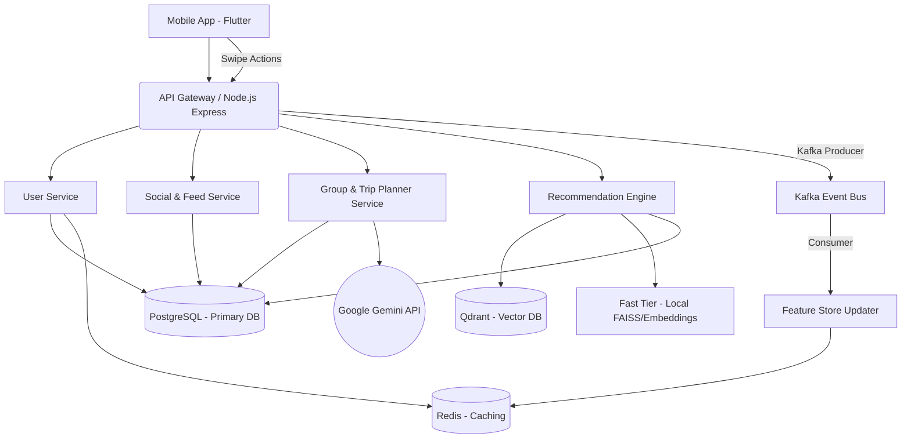

# 2. Kiến Trúc Kỹ Thuật (Technical Architecture)

## Sơ Đồ Kiến Trúc (Architecture Diagram)

## Luồng Dữ Liệu AI (AI Data Flow)

### 1. Luồng Thu Thập Dữ Liệu (Event Streaming)
Khi người dùng tương tác (Vuốt Like/Skip món ăn), hành động này không ghi trực tiếp vào Database chính mà được:
- Đẩy vào **Kafka (Topic: `swipe-events`)**.
- Consumer ngầm xử lý event và gọi `FeatureStore`.
- `FeatureStore` cập nhật lại trọng số sở thích của người dùng và lưu vào **Redis** (để truy xuất nhanh khi gọi Recommendation).

### 2. Luồng Gợi Ý (Recommendation Routing)
- **Fast Tier (Sử dụng hàng ngày):** Khi lướt (Swipe) ở Tab 3, hệ thống sử dụng thuật toán nội bộ (Vector Similarity trên Qdrant) kết hợp với Rule Engine (Loại bỏ món gây dị ứng) để trả kết quả dưới 200ms. Dữ liệu mồi được nạp qua caching của Redis.
- **Deep Tier (Trip Planner / Lịch Trình Nhóm):** Gom dữ liệu các thành viên nhóm bằng thuật toán *Pareto Aggregation* (để cân bằng sở thích), sau đó tạo Prompt và gọi tới **Google Gemini 1.5 Flash**. LLM trả về kết quả JSON, sau đó backend map lại các text này với món ăn thật trong hệ thống thông qua Embedding Search.

## Cấu Trúc Cơ Sở Dữ Liệu (Database Schema)
Hệ thống sử dụng PostgreSQL, quản lý schema thông qua các file SQL: `schema.sql`, `seed.sql`.
- `users`: Quản lý người dùng.
- `user_preferences`: Lưu trữ sở thích cá nhân.
- `dishes`: Món ăn (có trường `item_type` để phân loại combo/đơn lẻ).
- `restaurants`: Cửa hàng, tọa độ.
- `posts`, `post_likes`, `post_comments`: Mạng xã hội ẩm thực.
- `groups`, `group_members`, `orders`: Tính năng nhóm.
